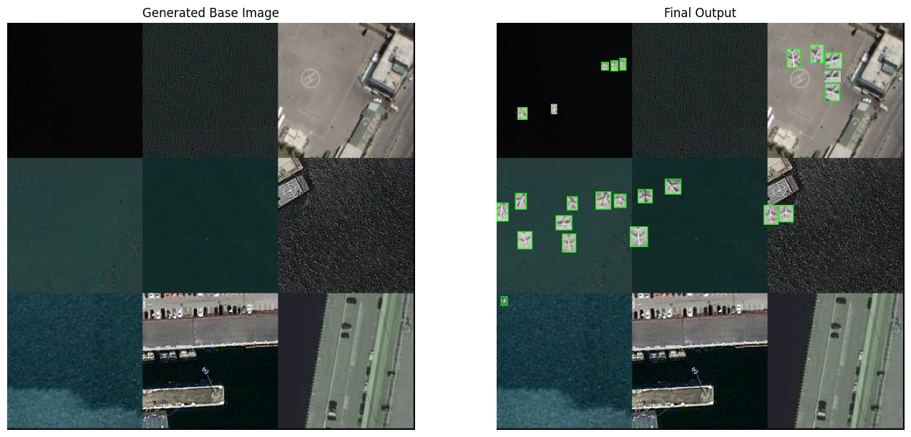

# __Satellite Image Augmentation__

## __Aim__

The goal of this project is to find a way to __synthesize new satellite images for Object Detection__. Additionally, I am trying to use image processing techniques to reduce dependency on libraries. 

---
## __Methodology__

Before I tell you about the methodology there are a few things I want you to understand and that is that there are two parts to achieving the output -

- The first part is generating an image that acts as a base for the objects 
- The second part is extracting the objects and placing them on the new image

Naturally there are 2 main scripts that are responsible for achieving the output:

1. `stitch_images.py`: This script's main focus is to take the following inputs:
    - directory: The path to the folder containing the images from which the patches are to be extracted.
    - output_size: The desired size of the output image (e.g., (256, 256)).
    - num_outputs: The number of output images to be generated.
    - output_directory: The path to the folder where the output images should be saved.
    - grids: The number of grids in x-axis. (e.g., If you input 3 it will generate an output with a 3 x 3 grid)

    The script then randomly extract patches from the images present in the directiry and stitch together a new image. Which we refer to as the "base image".

2. `add_objects.py`: This script takes the following as inputs:
    - image_dir:- Path to the images containing the objects
    - base_image_dir:- Path to the directory containing the base images
    - output_dir:- Path to the output folder 
    - num_outputs:- Number of outputs
---
## __Process__

---
## __Limitations__

- `No TIFF support`: The scripts only take PNG and JPG files as inputs. 
- `OBB Annotations`: The code only works for OBB based annotations.
    - For example: _x1, y1, x2, y2, x3, y3, x4, y4, label, difficulty_
    - This can easily be modified to work with any type of annotation
- `Object Background`: The annotations that will be placed on the image will have the background of object present with it as well. Thereby reducing the contextual features that will be extracted by the OD model at the time of training.
- `Not Immune to Bad Dataset`: If the dataset has wrong annotations that will definitely affect the outputs, it may add empty boxes on the image and classify it as the object of interest.
- `Missing Annotations`: On some occasions you may find some objects present but the annotations absent. _The reason for this is currently unknown._

---
## __Solutions to the Limitations__ _(if any)_

- There is a workaround for the `Object Background` & `Missing Annotations` limitations and it includes training a segmentation model to seperate the object from the background.
- This one is not necessarily a solution but it is definitely a good script to have in order to reduce the number of empty annotations. It will only work once the outputs are generated or can also be configured to work while the outputs are being generated. 
    - The idea is to write a script that iterates through the images. The user will randomly have an image pop-up along with the annotations and the line the annotations are present (for example: line 5 or line 2 etc.) will be displayed as labels. The user will have the following choices after viewing the image:
        1. Delete the image and it's corresponding annotation file
        2. Delete a particular annotation or a list of annotations
---
